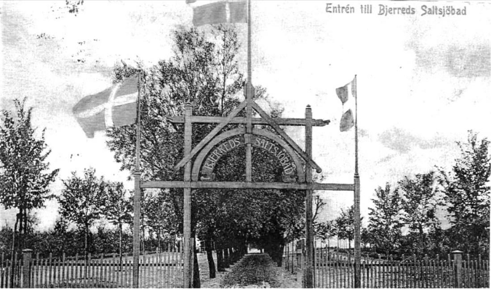

# Bjerred 1900

<!-- markdownlint-disable MD033 -->

<i>
Bjärreds historia innan och efter året 1900.
</i>

## ❓ Om projektet

**Bjerred 1900** samlar information och bilder om hur [[Bjärred]] var och såg ut under 1800- och 1900-talet. Sidan är under uppbyggnad och kommer att fyllas på med mer information och bilder allt eftersom.

Artiklarna på *Bjerred 1900* tar utgångspunk i året [[1900]]. Sen tittas det hundra år fram och hundra år tillbaka. Detta är tidsperioden som är mest intressant och är huvudfokus för *Bjerred 1900*. Något enstaka undantag kan förekomma.

## 🔎 Upptäck

Använd *sökfunktionen* eller börja med att upptäck någon av de artiklar som föreslås nedan.

- [[Bjärreds saltsjöbad]]
- Områden
  - [[Bjerehof]]
  - [[Löddesnäs]]

## ✍️ Bidra

**Vill du bidra med eget innehåll till Bjerred 1900?**

> Beskrivning av hur du bidrar med eget innehåll kommer snart att läggas till här.

**Har du upptäckt något som borde ändras eller som borde tas bort?**

Gå [hit](https://github.com/bjerred1900/bjerred1900.github.io/issues/new) och skapa ett ärende. Alternativt, skicka ett email till <kontakt@bjerred1900.org>.

## ⚙️ Teknisk information

Bjärred 1900 är byggt med [Jekyll](https://jekyllrb.com/) och [GitHub Pages](https://pages.github.com/). Detta gör att sidan är enkel att underhålla och att den är gratis att driva. GitHub är också en plattform som är välkänd för att vara pålitlig och säker. Eftersom Microsoft äger GitHub, så är det också en plattform som sannolikt kommer att finnas kvar under lång tid.

Självaste innehållet är skrivet i [Markdown](https://daringfireball.net/projects/markdown/), vilket gör det enkelt att skriva och redigera artiklar. Eftersom Markdown-filer också egentligen bara är textfiler, så är det också enkelt att versionhantera och bevara innehållet. Du kan ladda ner innehållet från Bjerred 1900 och öppna artiklarna i vilken textredigerare som helst.

## 🪪 Upphovsrätt

*Bjerred 1900* äger ***inte*** innehållet i artiklarna, bilderna, eller annat material. *Bjerred 1900* är enbart en aggregering av information från olika källor som finns publikt tillgängliga på internet eller i böcker eller i annan form. Om du äger något av innehållet och vill att det ska tas bort, vänligen kontakta *Bjerred 1900*.

## ✉️ Kontakt

Du kan kontakta *Bjerred 1900* på följande sätt:

| Kontaktform | |
| --- | --- |
| Email | <bjerred1900@outlook.com> |
| Ärende via GitHub | [Skapa ett ärende](https://github.com/bjerred1900/bjerred1900.github.io/issues/new) |
